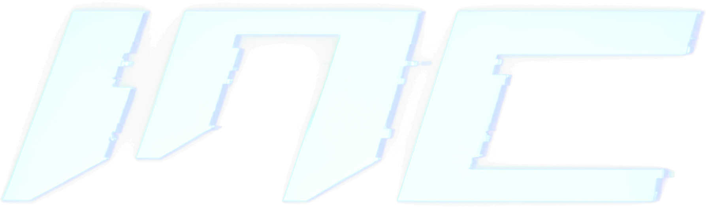

  

**INC** is a universal modular infrastructure, capable of hosting applications and engines.

## Releases

- **INC** — prebuilt runtime with terminal, console, platform, window, engine, renderer, level, and player modules backended by opengl, dx11.
- **ID Tech 4** — prebuilt as a loadable module for INC.

## How to Test

1. Place the desired module DLL(s) and corresponding .manifest into the /bin folder of INC.
2. Run `INC.exe`. The module will load automatically.  
3. To remove or reload modules at runtime, either delete the .manifest or use the console commands eg (unload, reload, load modulename).

## Community
https://discord.gg/CMqShG6frV

## Notes

- INC can host other engines or experimental modules beyond ID Tech 4 and X-Ray Engine.

